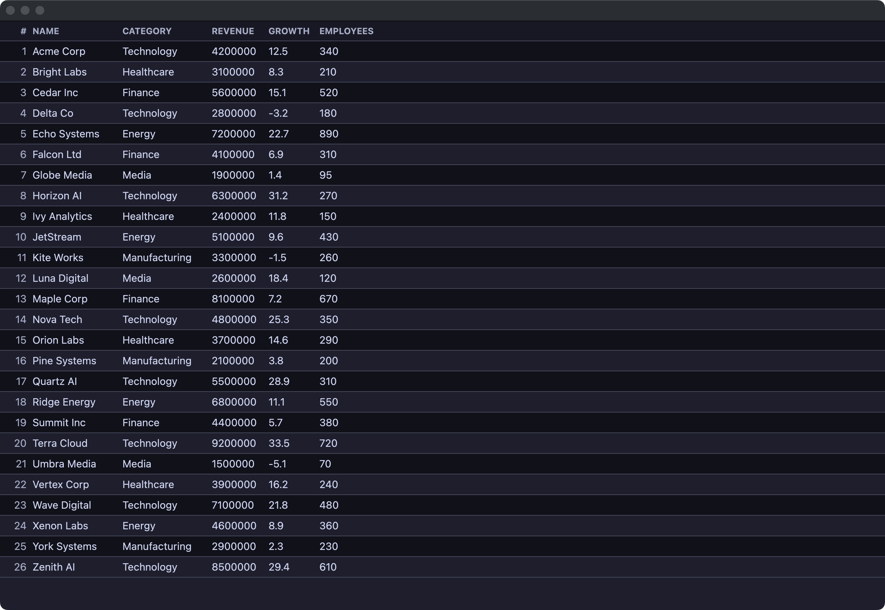
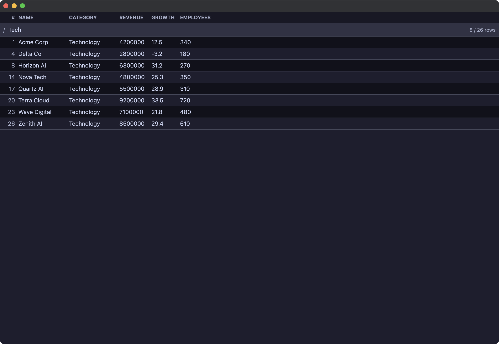
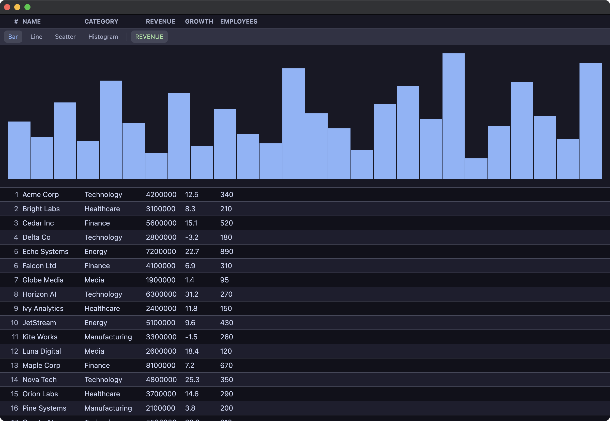

# csvr

[](https://github.com/rysk-tanaka/csvr/actions/workflows/lint.yml)
[](https://github.com/rysk-tanaka/csvr/actions/workflows/test.yml)
[](https://github.com/rysk-tanaka/csvr/actions/workflows/build.yml)
[](https://github.com/rysk-tanaka/csvr/releases/latest)
[](https://github.com/zed-industries/zed/tree/main/crates/gpui)
[](./LICENSE)

> CLI から起動する CSV ビューワー

---

## 概要

csvr はターミナルから CSV ファイルを指定して GUI ウィンドウでテーブル表示するツールです。
[GPUI](https://github.com/zed-industries/zed/tree/main/crates/gpui) で構築しています。

- CSV / xlsx / xls ファイルに対応
- ファイル指定（`csvr data.csv`）またはパイプ入力（`cat data.csv | csvr`）
- 文字エンコーディング自動検出（Shift-JIS 等の非 UTF-8 ファイルも表示可能）
- macOS ネイティブ（Metal レンダリング）

## スクリーンショット

| テーブル表示 | 検索 | グラフプレビュー |
| :---: | :---: | :---: |
|  |  |  |

---

## 機能

- CSV / xlsx / xls 読み込み・テーブル表示
- 文字エンコーディング自動検出（Shift-JIS 等）
- 列固定ヘッダー
- 列幅の自動調整
- 行番号表示
- インクリメンタル検索・フィルタ（`Cmd+F` / `/`）
- 正規表現行フィルタ（`&`） — 全列または `col:pattern` で列指定フィルタ
- 列ソート（昇順/降順） — ヘッダークリックで昇順→降順→解除
- 行ホバーハイライト — マウスカーソル位置の行を視覚的に強調
- セル選択とコピー（`Cmd+C`） — クリック/矢印キーで選択、セル値またはタブ区切り行をコピー
- エクスポート — JSON（`Cmd+Shift+J`）/ Markdown（`Cmd+Shift+M`）をクリップボードにコピー
- 列の表示/非表示（`*`） — 正規表現で列名をフィルタ
- 列固定（`f`） — 左端 N 列を横スクロール時に固定表示
- ステータスバー — 総行数・フィルタ後件数・選択セルの列統計（Count/Sum/Min/Max/Mean/Median/Stddev）
- グラフプレビュー（`Cmd+G`） — 棒グラフ・折れ線・散布図・ヒストグラム

---

## セットアップ

### インストール

[GitHub Releases](https://github.com/rysk-tanaka/csvr/releases) からビルド済みバイナリをダウンロードできます。

[mise](https://mise.jdx.dev/) を使う場合:

```bash
mise use -g "github:rysk-tanaka/csvr"
```

### ソースからビルドする場合の前提条件

GPUI は Metal シェーダーをコンパイルするため、Xcode のフルインストールが必要です。詳細は [docs/setup.md](./docs/setup.md) を参照してください。

- macOS
- Rust toolchain
- Xcode（Command Line Tools だけでは不足）
- Metal Toolchain

---

## 使い方

```bash
# CSV ファイル
csvr data.csv

# Excel ファイル
csvr data.xlsx

# パイプ入力
cat data.csv | csvr
```

---

## 開発

```bash
cargo run -- data.csv    # 開発実行
cargo build --release    # リリースビルド
cargo test               # テスト
cargo clippy             # lint
cargo fmt --check        # フォーマットチェック
```

---

## 技術スタック

| クレート | 用途 |
| --- | --- |
| [gpui](https://github.com/zed-industries/zed/tree/main/crates/gpui) | UI フレームワーク |
| [csv](https://crates.io/crates/csv) | CSV パース |
| [calamine](https://crates.io/crates/calamine) | xlsx/xls 読み込み |
| [regex](https://crates.io/crates/regex) | 正規表現（列/行フィルタ） |
| [chardetng](https://crates.io/crates/chardetng) + [encoding_rs](https://crates.io/crates/encoding_rs) | 文字エンコーディング検出・変換 |

---

## ライセンス

MIT License — © Ryosuke Tanaka

サードパーティのライセンス情報は [THIRD_PARTY_LICENSES.html](./THIRD_PARTY_LICENSES.html) を参照してください。
